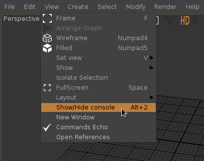
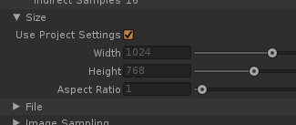
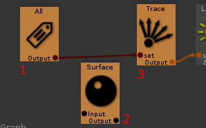
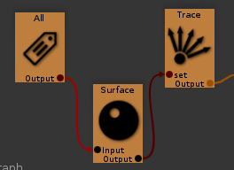
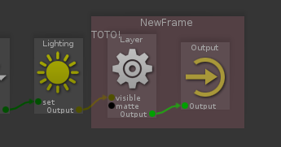
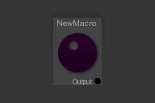
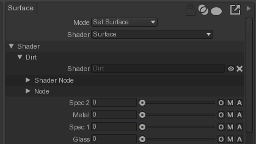
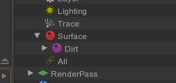

# Guerilla Code Snippet

## The official Python API documentation

There is some examples in the _Examples_ section of the [official Python API documentation](http://guerillarender.com/doc/1.4/PythonSDK/index.html).

## Use console

Guerilla console is very useful, use it!

Show it using _"View"/"Show/Hide console"_:



Once in the console, you can create a Python tab using _File/New/Python_ or faster using _Ctrl+Shift+N_ shortcut. You can also save your Python file and so, keep it for the next Guerilla session.

Ensure _"View"/"Command Echo"_ is active. With it you will see what Guerilla does (as Lua command) when you are manipulating UI (ala Maya). This is very useful to get attribute (plug) names.

For example, when you change _Filter_ value of the _Pixel Filter_ section of a RenderPass you will see:

```lua
local mod=Document:modify()
mod.set(_"RenderPass.PixelFilter","triangle")
mod.finish()
```

This is the lua code executed by Guerilla.

In Python, it became:

```python
import guerilla

# as you actually modify the gproject values, you to use a Modifier() context
with guerilla.Modifier() as mod:
    guerilla.pynode("RenderPass.PixelFilter").set("triangle")
    # or
    guerilla.pynode("RenderPass").PixelFilter.set("triangle")
    # or even
    guerilla.Document().RenderPass.PixelFilter.set("triangle")
```

## Modification context

As you've seen in previous section, guerilla need a modification context to modify nodes properly:

```lua
local mod=Document:modify()
-- do some stuff
mod.finish()
```

Python API rely on [the with statement](https://docs.python.org/2/reference/compound_stmts.html#with) to do it. This mean the python equivalent of the above lua code is:

```python
with guerilla.Modifier() as mod:
   # do some stuff
```

More infos [here](http://guerillarender.com/doc/1.4/PythonSDK/api/Modifier.html#guerilla.Modifier).

## Node type from UI

You can get node type from Guerilla's _Node List_ tab. Node type is displayed on the right on the node name:


Here you can see *Beauty* is actually a `LayoutOut` node type.

## Node from its name

Guerilla provide two way to get a node from its name (or path):

```python
guerilla.pynode("Toto")
guerilla._("Toto")
```

Both will return and instance of node named "Toto". The second is just a shortcut of the first.

## Node infos

Print some infos from selected node

```python
import guerilla

# reference to the Guerilla document
doc = guerilla.Document()

for node in doc.selection():
    print "Type:", type(node)
    print "Name:", node.name
    print "Path:", node.path
    print "Parent's name:", node.parent.name
    print "Plugs:"
    for plug in node.plugs():
        print "  ", plug.name
```

## Put a node inside another node

This move node `a ` inside node `b`:

```python
with guerilla.Modifier() as mod:
    a.move(b)
```

Be sure  `a` is disconnected from other nodes before move it.

## Iterate over RenderPass/Layer/AOV

```python
import guerilla

# Document is the root node in Guerilla
root = guerilla.Document()

for render_pass in root.children(type='RenderPass'):
    print render_pass.name
    for layer in render_pass.children(type='RenderLayer'):
        print layer.name
        for aov in layer.children(type='LayerOut'):
            # actual aov name is retrived using PlugName.get()
            print aov.name, aov.PlugName.get()
```

On a fresh empty scene you will get:

```
RenderPass
Layer
Input1 Beauty
```

## Get/Set attribute

In Guerilla, node attributes are of type `guerilla.Plug` and you get/set values using `get()` and `set()` method.

### Change global resolution

```python
import guerilla

doc = guerilla.Document()

with guerilla.Modifier() as mod:
    doc.ProjectWidth.set(320)
    doc.ProjectHeight.set(240)
```

Or you can divide resolution by two this way:

```python
import guerilla

doc = guerilla.Document()

with guerilla.Modifier() as mod:
    doc.ProjectWidth.set(doc.ProjectWidth.get()/2)
    doc.ProjectHeight.set(doc.ProjectHeight.get()/2)
```

## Enable/Disable "Use Project Settings" for a given RenderPass



When you click on the _Use Project Settings_ checkbox in a RenderPass, Guerilla does some script under the hood.

```python
import guerilla

doc = guerilla.Document()

# assume you have a selected RenderPass
rp = doc.selection()[0]

# disconnect from Project Settings
with guerilla.Modifier() as mod:
    rp.Width.disconnect(doc.ProjectWidth)
    rp.Height.disconnect(doc.ProjectHeight)
    rp.AspectRatio.disconnect(doc.ProjectAspectRatio)

# reconnect to Project Settings
with guerilla.Modifier() as mod:
    rp.Width.connect(doc.ProjectWidth)
    rp.Height.connect(doc.ProjectHeight)
    rp.AspectRatio.connect(doc.ProjectAspectRatio)
```

## Check if two nodes are connected in any order

```python
def are_connected(a, b):
    # test if nodes are connected in one side...
    for out in a.getoutputs():
        for in_ in b.getinputs():
            if in_.Plug.isconnected(out.Plug):
                return True

    # ...and the other side
    for out in b.getoutputs():
        for in_ in a.getinputs():
            if in_.Plug.isconnected(out.Plug):
                return True

    # we can't find any connection
    return False
```

Select two connected nodes and:

```python
# get the two first selected nodes
a, b = guerilla.Document().selection()[0:2]
print are_connected(a, b) # should print True
```

## Iterate over all input nodes of a given one

```python
def input_connected_nodes(node):

    for in_ in node.getinputs():

        connected_plug = in_.getconnected()

        if not connected_plug:
            continue

        connected_node = connected_plug.parent

        yield connected_node

        # do this recursively
        input_connected_nodes(connected_node)
```

Select one node connected to some input nodes:


And:

```python
node = guerilla.Document().selection()[0]
print [n.name for n in input_connected_nodes(node)]
# ['Trace', 'Surface', 'All']
```

You can modify this function to deal with outputs replacing `getinputs()` method by `getoutputs()`.

## Iterate over every nodes on the left side of a given node

```python
import guerilla

def left_nodes(node):
    # get node position and consider it as source
    src_x, src_y = node.NodePos.get()

    # iterate over every node of the group
    for n in node.parent.children():

        # get node position
        x, _ = n.NodePos.get()

        # compare if the current node is on the left of the original
        if x < src_x:
            yield n
```

Select a node inside `RenderGraph` and:

```python
node = guerilla.Document().selection()[0]
print [n.name for n in left_nodes(node)]
```

This will print name of every nodes positioned on the left of the selected one.

## Put a given node between two nodes

This function put node `b` between `a` and `c` so you get `a` connected to `b` connected to `c`.

Its assume:
* `a` have one single output
* `b` have one single input and one single output
* `c` have one single input

```python
import guerilla

def put_between(a, b, c):

    # we assume the nodes have one single input and output
    a_out = a.getoutputs()[0].Plug
    b_in  = b.getinputs()[0].Plug
    b_out = b.getoutputs()[0].Plug
    c_in  = c.getinputs()[0].Plug

    # disconnect a and c if connected
    if c_in.isconnected(a_out):
        c_in.disconnect(a_out)

    b_in.connect(a_out)
    c_in.connect(b_out)
```

Select three nodes in the order you want to connect them:



```python
a,b,c = guerilla.Document().selection()[0:3]

# you need a modification context as you will modify the graph
with guerilla.Modifier() as mod:
    put_between(a, b, c)
```



Try to improve the code to move the node between `a` and `b`. ;)

## Create a frame (like Nuke backdrop)

This create a `GraphFrame` node which is like Nuke's backdrops.

```python
import guerilla

# get RenderGraph node
rg = guerilla.pynode("RenderGraph")

# you need a modification context as you modify the gproject
with guerilla.Modifier() as mod:
    frame = mod.createnode("NewFrame", type="GraphFrame", parent=rg)

    # you can customize the frame
    frame.Notes.set("TOTO!")
    frame.Position.set((-200, -50))
    frame.Size.set((200, 150))
    frame.Color.set((1.0, 0.5, 0.6))
    frame.Opacity.set(0.2)
```



## Iterate over every nodes inside a given `GraphFrame` node

```python
def nodes_in_frame(frame):

    # we retrive position and size
    p_x, p_y = frame.Position.get()
    s_x, s_y = frame.Size.get()

    # we compute the box borders
    x_min = p_x
    x_max = p_x+s_x
    y_min = p_y
    y_max = p_y+s_y

    # now we iterate over every node near the GraphFrame. Note we only get
    # nodes inheriting from 'RenderGraphNode' type because of the 'NodePos'
    # attribute.
    for node in frame.parent.children(type='RenderGraphNode'):

        n_x, n_y = node.NodePos.get()

        # test if node position is inside the box
        if all((x_min < n_x < x_max,
                y_min < n_y < y_max)):
            yield node
```

If we use the `frame` variable created in the previous example:

```python
print [n.name for n in nodes_in_frame(frame)]
# ['Layer', 'Output']
```

## Know if a node is inside a frame

This is a variation of the previous one, returning True if the given node is inside the given frame.

```python
def is_node_in_frame(node, frame):

    # we retrieve position and size
    p_x, p_y = frame.Position.get()
    s_x, s_y = frame.Size.get()

    # we compute the box borders
    x_min = p_x
    x_max = p_x+s_x
    y_min = p_y
    y_max = p_y+s_y

    n_x, n_y = node.NodePos.get()

     # test if node position is inside the box
     return all((x_min < n_x < x_max,
                 y_min < n_y < y_max))
```

With the previously created `GraphFrame`:

```python
node = guerilla.pynode("RenderGraph|Layer")
print node_in_frame(node, frame)
# True
```

## Create a macro inside a RenderGraph

A simple snippet to create a macro in script the same way Guerilla creates it when you do manually:



```python
import guerilla

rg = guerilla.pynode("RenderGraph")

with guerilla.Modifier() as mod:
    macro = mod.createnode("NewMacro", type="RenderGraphMacro", parent=rg)
    out = mod.createnode("Output", type="RenderGraphMacroOutput", parent=macro)
    in_ = mod.createnode("Input1", type="RenderGraphInput", parent=out)
    out2 = mod.createnode("Output1", type="RenderGraphOutput", parent=macro)
    out2.Plug.adddependency(in_.Plug)
    in_.PlugName.connect(out2.PlugName)
```

## Create a sub shader

This snippet create a subshader on "Dirt" parameter of the default Surface shader:





```python
import guerilla

# default "Surface" shader
surf_shader = guerilla.pynode("RenderGraph|Surface")

with guerilla.Modifier() as gmod:

    # create empty sub shader on "Dirt" attribute
    sub_shader = gmod.createnode("Dirt", type="ShaderNodeMacro", parent=surf_shader)

    # create default output node inside the sub shader
    main_out = gmod.createnode("Output", type="ShaderNodeMacroOutput", parent=sub_shader)
    main_out.NodePos.set((-90,-17.5))

    # create input of the output node
    in_node = gmod.createnode("Input1", type="ShaderNodeIn", parent=main_out)
    in_node.Desc.set(guerilla.types('color'))
    in_node.Value.set((0.5, 0.0, 0.5))

    # create (hidden) output ouf the main output node
    out_plug = gmod.createnode("Output1", type="ShaderNodeOut",parent=sub_shader)
    out_plug.PlugName.set("Output")

    gmod.adddependency(out_plug.Plug, in_node.Plug)
    gmod.connect(in_node.PlugName, out_plug.PlugName)
```

## Check if a node has an input/output attribute with given name

The `hasPlug()` method rely on the low level Guerilla `Plug` system. It's often hard for user to understand them as it's not related to what they see in the UI. This two function

```python
def has_plug_name(node, name, inputs=True, outputs=True):
    '''Return if the given node has plug with PlugName attribute with the given
    name.

    :param (guerilla.Node) node:
    Guerilla node to check for inputs/outputs names

    :param (str) name:
    The plug name to look for

    :param (bool) inputs:
    If True, will check for input plug names

    :param (bool) outputs:
    If True, will check for output plug names
    '''
    if inputs:
        for i in node.getinputs():

            if i.PlugName.get() == name:
                return True

    if outputs:
        for o in node.getoutputs():

            if o.PlugName.get() == name:
                return True

    return False
```

Now we check the default _Trace_ node have a _set_ input attribute:


```python
import guerilla

rg = guerilla.pynode("RenderGraph")
print has_plug_name(rg.Trace, name="set", inputs=True, outputs=False)
# True
```

You can try this for multiple other nodes.

## Get the node connected to the given attribute of a given node

This function return the node connected to the given input/output name. It's important to understant that if there is multiple input/output node with the given name, only the first one is given (it doesn't appear often but you have to know it).

```python
def connected_node(node, name, inputs=True, outputs=True):

    if inputs:
        for i in node.getinputs():

            if i.PlugName.get() == name:

                 con_out = i.getconnected()

                 if con_out:

                     return con_out.parent

    if outputs:
        for o in node.getoutputs():

            if o.PlugName.get() == name:

                 for con_in in o.getconnected():

                     return con_in.parent
```

Here we retrive the node connected to the _set_ input attribute of the trace node:


```python
import guerilla

rg = guerilla.pynode("RenderGraph")
node = connected_node(rg.Trace, name="set", inputs=True, outputs=False)
print node.name
# "Surface"
```

As said before, in the case of output, this function only return the first encounter output. You can modify this function to return a list instead of the first one.
