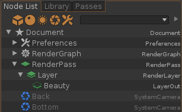

# Guerilla Code Snippet

## The official Python API documentation

There is some examples in the _Examples_ section of the [official Python API documentation](http://guerillarender.com/doc/1.4/PythonSDK/index.html).

## Use console

Guerilla console is very useful, use it!

Show it using _"View"/"Show/Hide console"_.

Once in the console, you can create a Python tab using _File/New/Python_ or faster using _Ctrl+Shift+N_ shortcut. You can also save your Python file and so, keep it for the next Guerilla session.

Ensure _"View"/"Command Echo"_ is active. With it you will see what Guerilla does (as Lua command) when you are manipulating UI (ala Maya). This is very useful to get attribute (plug) names.

For example, when you change _Filter_ value of the _Pixel Filter_ section of a RenderPass you will see:

```lua
local mod=Document:modify()
mod.set(_"RenderPass.PixelFilter","triangle")
mod.finish()
```

This is the lua code executed by Guerilla.

In Python, it became:

```python
import guerilla

# as you actually modify the gproject values, you to use a Modifier() context
with guerilla.Modifier() as mod:
    guerilla.pynode("RenderPass.PixelFilter").set("triangle")
    # or
    guerilla.pynode("RenderPass").PixelFilter.set("triangle")
    # or even
    guerilla.Document().RenderPass.PixelFilter.set("triangle")
```

## Modification context

As you've seen in previous section, guerilla need a modification context to modify nodes properly:

```lua
local mod=Document:modify()
-- do some stuff
mod.finish()
```

Python API rely on [the with statement](https://docs.python.org/2/reference/compound_stmts.html#with) to do it. This mean the python equivalent of the above lua code is:

```python
with guerilla.Modifier() as mod:
   # do some stuff
```

More infos [here](http://guerillarender.com/doc/1.4/PythonSDK/api/Modifier.html#guerilla.Modifier).

## Node type from UI

You can get node type from Guerilla's _Node List_ tab. Node type is displayed on the right on the node name.



## Node from its name

Guerilla provide two way to get a node from its name (or path):

```python
guerilla.pynode("Toto")
guerilla._("Toto")
```

Both will return and instance of node named "Toto". The second is just a shortcut of the first.

## Node infos

Print some infos from selected node

```python
import guerilla

# reference to the Guerilla document
doc = guerilla.Document()

for node in doc.selection():
    print "Type:", type(node)
    print "Name:", node.name
    print "Path:", node.path
    print "Parent's name:", node.parent.name
    print "Plugs:"
    for plug in node.plugs():
        print "  ", plug.name
```

## Iterate over RenderPass/Layer/AOV

```python
import guerilla

# Document is the root node in Guerilla
root = guerilla.Document()

for render_pass in root.children(type='RenderPass'):
    print render_pass.name
    for layer in render_pass.children(type='RenderLayer'):
        print layer.name
        for aov in layer.children(type='LayerOut'):
            # actual aov name is retrived using PlugName.get()
            print aov.name, aov.PlugName.get()
```

## Get/Set attribute

In Guerilla, node attributes are of type `guerilla.Plug` and you get/set values using `get()` and `set()` method.

### Change global resolution

```python
import guerilla

doc = guerilla.Document()

with guerilla.Modifier() as mod:
    doc.ProjectWidth.set(320)
    doc.ProjectHeight.set(240)
```

Or you can divide resolution by two this way:

```python
import guerilla

doc = guerilla.Document()

with guerilla.Modifier() as mod:
    doc.ProjectWidth.set(doc.ProjectWidth.get()/2)
    doc.ProjectHeight.set(doc.ProjectHeight.get()/2)
```

## Enable/Disable "Use Project Settings" for a given RenderPass

When you click on the _Use Project Settings_ checkbox in a RenderPass, Guerilla does some script under the hood.

```python
import guerilla

doc = guerilla.Document()

# assume you have a selected RenderPass
rp = doc.selection()[0]

# disconnect from Project Settings
with guerilla.Modifier() as mod:
    rp.Width.disconnect(doc.ProjectWidth)
    rp.Height.disconnect(doc.ProjectHeight)
    rp.AspectRatio.disconnect(doc.ProjectAspectRatio)

# reconnect to Project Settings
with guerilla.Modifier() as mod:
    rp.Width.connect(doc.ProjectWidth)
    rp.Height.connect(doc.ProjectHeight)
    rp.AspectRatio.connect(doc.ProjectAspectRatio)
```
